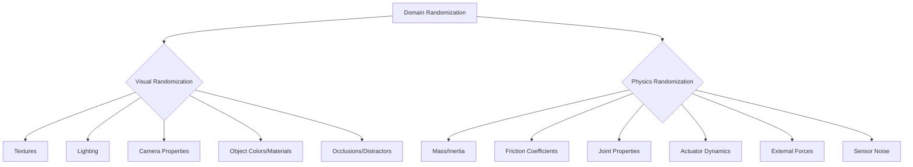

# Chapter 12: Sim-to-Real Transfer and Hardware Deployment

## Introduction

Training intelligent robot policies directly on physical hardware is often impractical due to time constraints, cost, and potential damage to the robot. Simulation offers a safe, scalable, and efficient alternative. However, policies trained in simulation often perform poorly when transferred to the real world—a phenomenon known as the **"reality gap"**.

This chapter delves into the critical techniques and best practices for successfully bridging this reality gap, enabling robust transfer of policies from the virtual to the physical domain. We will explore domain randomization, domain adaptation, and methods for quantifying and troubleshooting the reality gap.

:::tip Learning Objectives
By the end of this chapter, you will be able to:
- Understand the concept of the reality gap and its contributing factors.
- Implement domain randomization strategies in NVIDIA Isaac Sim to improve policy robustness.
- Quantify the performance degradation between simulation and reality.
- Develop a systematic approach to troubleshooting sim-to-real transfer failures.
- Strategize for deploying simulation-trained policies onto physical hardware platforms.
:::

---

## The Reality Gap: Why Simulation is Not Enough

Even the most sophisticated physics simulators cannot perfectly replicate the complexities of the real world. Subtle differences accumulate to create a significant performance drop when a sim-trained policy meets its real-world counterpart.

### Sources of the Reality Gap

1.  **Physics Discrepancies**:
    -   **Contact models**: Friction, restitution, and contact forces are simplified in simulation.
    -   **Inertial properties**: Exact mass and inertia distribution of robot links and objects are rarely known perfectly.
    -   **Actuator dynamics**: Motors have non-linearities, backlash, and unmodeled friction not captured in simple models.
2.  **Sensor Discrepancies**:
    -   **Noise characteristics**: Real-world sensors have complex noise patterns (Gaussian, speckle, bias) that are hard to model accurately.
    -   **Camera intrinsics/extrinsics**: Imperfect calibration can lead to slight misalignments.
    -   **Lighting conditions**: Simulation struggles to capture the full spectrum of real-world illumination variations.
3.  **Visual Discrepancies**:
    -   **Textures and materials**: Simulated textures may not perfectly match real-world reflectance properties.
    -   **Clutter and occlusions**: Real environments often have unmodeled objects or complex occlusions.
4.  **Modeling Errors**:
    -   **URDF/SDF inaccuracies**: Small errors in link lengths, joint limits, or center of mass can compound.
    -   **Environmental factors**: Air currents, temperature changes, and vibrations are usually ignored in simulation.

---

## Bridging the Gap with Domain Randomization

**Domain Randomization (DR)** is a powerful technique that addresses the reality gap by training policies to be invariant to variations between the simulated and real worlds. Instead of trying to make the simulation perfectly match reality, DR makes the simulation *diverse enough* that reality appears as just another variation within the training distribution.

The core idea is to randomize non-essential aspects of the simulation while keeping the core task dynamics consistent.

### Domain Randomization Checklist for Isaac Sim

Here's a checklist for implementing effective domain randomization, particularly useful within NVIDIA Isaac Sim:

#### Visual Randomization
-   [ ] **Textures**: Apply random textures to robot links, objects, and the ground plane. Utilize a library of diverse materials (e.g., from Omniverse Asset Library) and randomize their scale, rotation, and tiling.
-   [ ] **Lighting**: Randomize the position, intensity, color, and number of light sources. Consider adding ambient light randomization and HDR environment maps.
-   [ ] **Camera Properties**: Add small random perturbations to camera position, orientation (roll, pitch, yaw), field of view (FOV), and focal length. Also randomize image post-processing effects like brightness, contrast, and saturation.
-   [ ] **Object Color**: Randomize the color and material properties (e.g., metallic, roughness) of target objects and background elements.
-   [ ] **Occlusions/Distractors**: Randomly spawn simple geometric shapes or common objects in the scene to create varying levels of occlusion and clutter.

#### Physics and Dynamics Randomization
-   [ ] **Mass and Inertia**: Randomize the mass of the robot's links and objects. Crucially, randomize the components of the inertia tensor (ixx, iyy, izz, ixy, ixz, iyz) and the center of mass offset.
-   [ ] **Friction Coefficients**: Randomize the static (`mu`) and dynamic (`mu2`) friction coefficients between all contacting surfaces (robot-ground, robot-object, object-table).
-   [ ] **Joint Properties**: Introduce noise to joint damping, friction (e.g., Coulomb friction), and stiffness. Randomize joint position and velocity limits within reasonable bounds.
-   [ ] **Actuator Dynamics**: Model and randomize motor delays, maximum torque/force, and any observed backlash.
-   [ ] **External Forces**: Apply small, random external forces or torques to the robot's body or joints to simulate unmodeled disturbances (e.g., wind gusts, gentle nudges).
-   [ ] **Sensor Noise**: Add realistic noise models to all sensor readings:
    -   **Camera**: Gaussian noise, salt-and-pepper noise, motion blur.
    -   **IMU**: Bias, drift, scale factor errors.
    -   **Joint Encoders**: Quantization noise.

### Domain Randomization Implementation in Isaac Sim

NVIDIA Isaac Sim, especially when used with Isaac Lab, provides powerful APIs for implementing domain randomization. You can script parameter randomization using Python, dynamically changing properties of assets and the environment during simulation episodes.

---

## Quantifying the Reality Gap

Measuring the reality gap helps you understand how much generalization your policy has achieved and where to focus further randomization efforts.

### Key Metrics

1.  **Policy Success Rate Drop**:
    -   **Definition**: The difference in task success rate between simulation and the real world.
    -   **Calculation**: `(Success_Rate_Real - Success_Rate_Sim) / Success_Rate_Sim * 100%` (for percentage drop).
    -   **Interpretation**: A high percentage drop (e.g., >25%) indicates a significant reality gap.
2.  **State Trajectory Divergence**:
    -   **Definition**: How closely robot state trajectories (e.g., joint positions, end-effector poses) match between simulation and reality for the same commanded task.
    -   **Calculation**: Can use metrics like Mean Squared Error (MSE) or Dynamic Time Warping (DTW) distance between corresponding time series data from sim and real robot runs.
    -   **Interpretation**: Large divergence suggests inaccuracies in physics, control, or state estimation.
3.  **Sensor Data Distribution Shift**:
    -   **Definition**: The statistical difference between sensor readings (e.g., camera images, IMU data) collected in simulation versus the real world.
    -   **Calculation**: Advanced metrics like Maximum Mean Discrepancy (MMD) or Kullback-Leibler (KL) divergence can compare the probability distributions of the data. Simpler methods include comparing histograms of pixel intensities or IMU readings.
    -   **Interpretation**: A large shift indicates visual or sensor modeling discrepancies that need more aggressive randomization.

---

## Sim-to-Real Troubleshooting Decision Tree

When your policy works flawlessly in simulation but struggles or fails in reality, use this decision tree to diagnose the problem:

```mermaid
graph TD
    A[Policy Fails in Real World?] --> B{Catastrophic Failure<br/>(e.g., robot falls immediately)?}
    B -- Yes --> C[Dynamics Randomization Insufficient.<br/>Check: Mass, Inertia, Friction, Actuator Dynamics.<br/>Is there a fundamental physics effect missing?]
    B -- No --> D{Fails on Specific Subsets<br/>(e.g., only with certain object colors/lighting)?}
    D -- Yes --> E[Visual Randomization Insufficient.<br/>Check: Textures, Lighting, Object Colors, Occlusions.<br/>Are real-world sensor characteristics modeled?]
    D -- No --> F{Behavior Noisy or Hesitant?}
    F -- Yes --> G[Sensor Noise Model Inaccurate or Insufficient.<br/>Check: Sensor noise levels, filter parameters.<br/>Is real-world data much noisier than simulated?]
    F -- No --> H{Performance Degradation Over Time?}
    H -- Yes --> I[State Estimation Problem.<br/>Check: IMU drift, odometry errors, filter accuracy.<br/>Does small errors accumulate?]
    H -- No --> J[Systematic Mismatch: Review all URDF/SDF parameters.<br/>Perform parameter identification on real robot.]
    C & E & G & I & J --> K[Refine Randomization/Models & Retrain]
```

---

## The Sim-to-Real Pipeline

```mermaid
graph TD
    A[Policy Training in Sim] --> B{Apply Domain Randomization}
    B --> C[Simulated Environment<br/>(Isaac Sim)]
    C --> D[Policy Learning<br/>(RL, IL)]
    D --> E[Trained Policy]
    E --> F{Deployment}
    F --> G[Real Robot<br/>(Jetson, Unitree)]
    G --> H[Physical Environment]
    H --> I[Sensor Data]
    I --> E
    F --> J[Reality Gap Analysis]
    J --> B
```

---

## Domain Randomization Types



---

## Teacher-Student Distillation Workflow

```mermaid
graph TD
    A[Simulated Env. (Isaac Sim)] --> B{Train Teacher Policy<br/>(Privileged Info)}
    B --> C[Teacher Policy]
    C --> D{Generate Demonstrations<br/>in Sim}
    D --> E[Demonstration Dataset]
    E --> F{Train Student Policy<br/>(Non-Privileged Info)}
    F --> G[Student Policy (Sim-Trained)]
    G --> H[Real Robot Deployment]
    H --> I[Optional: Real-World Fine-tuning]
    I --> J[Deployed Policy]
```

---

## Reality Gap Metrics Overview

```mermaid
graph TD
    A[Reality Gap Metrics] --> B{Policy Success Rate Drop}
    B --> B1[Formula: (SR_Real - SR_Sim) / SR_Sim * 100%]
    B --> B2[Interpretation: % Performance Degradation]

    A --> C{State Trajectory Divergence}
    C --> C1[Metric: MSE or DTW]
    C --> C2[Interpretation: Inaccuracies in Physics/Control/Estimation]

    A --> D{Sensor Data Distribution Shift}
    D --> D1[Metric: MMD or KL Divergence]
    D --> D2[Interpretation: Visual/Sensor Modeling Discrepancies]
```

---

## Hardware Deployment Considerations

Deploying policies to physical hardware requires careful attention to the specific robot platform.

### Unitree Robot Best Practices

For platforms like the Unitree G1 or Go2, several strategies enhance sim-to-real transfer:

1.  **Teacher-Student Distillation Workflow**:
    -   **Teacher Policy**: Train a policy in simulation that has access to "privileged information" (data not available from real-world sensors, e.g., true linear velocity, exact contact forces, friction values). This policy can learn optimal behavior quickly.
    -   **Student Policy**: Train a second policy that only uses "non-privileged" observations (data from real sensors like joint encoders, IMU, camera). The student policy is trained via behavioral cloning to mimic the actions of the teacher policy.
    -   **Fine-tuning**: Optionally, the student policy can be fine-tuned directly on the real robot with a small amount of real-world data. This is crucial for achieving high performance.
2.  **Observation Management**: Ensure that your deployed policy *only* relies on observations directly measurable by the robot's real-world sensors. Any privileged information used by a teacher policy *must* be excluded from the student policy.
3.  **Sim-to-Sim Verification**: Before moving to hardware, test your policies across different simulation physics backends or slightly varied simulation setups to ensure robustness to minor simulation discrepancies.

### Jetson Economy Tier: Navigation Policy Deployment

For the budget-friendly Jetson Economy Tier (often using Jetson Nano, Xavier NX, or Orin Nano), deploying navigation policies from simulation to real hardware involves optimizing for resource constraints and leveraging NVIDIA's JetPack SDK.

#### 1. Hardware and Software Setup
-   **Jetson Module**: Ensure your Jetson module is properly flashed with the latest JetPack SDK (which includes CUDA, cuDNN, TensorRT, and ROS 2 pre-installed).
-   **ROS 2**: Use the pre-installed ROS 2 distribution on JetPack (typically Foxy or Humble, align with your simulated environment).
-   **Peripherals**: Connect a compatible LiDAR/depth camera and motor drivers to your Jetson.

#### 2. Policy Export and Optimization
-   **Export Format**: Export your navigation policy (e.g., a trained neural network) from Isaac Sim in an optimized format like ONNX or directly to a TensorRT engine. TensorRT provides significant inference speedups on Jetson GPUs.
    ```bash
    # Example command for converting ONNX to TensorRT engine (simplified)
    trtexec --onnx=policy.onnx --saveEngine=policy.engine --fp16
    ```
-   **Quantization**: Consider post-training quantization (e.g., INT8) if your policy is large and you need to maximize performance within the Jetson's memory and compute limits.

#### 3. ROS 2 Integration
-   **ROS 2 Node**: Wrap your optimized policy (ONNX/TensorRT engine) in a ROS 2 node. This node will subscribe to sensor topics (LiDAR, odometry, camera), perform inference using the optimized policy, and publish motor commands to your robot's base controller.
-   **Message Types**: Ensure consistency in ROS 2 message types between your simulated and real sensor data and robot commands (e.g., `sensor_msgs/LaserScan`, `geometry_msgs/Twist`).

#### 4. Real-World Testing and Fine-tuning
-   **Initial Testing**: Start with basic tests in a controlled environment. Verify that motor commands translate to expected robot movements and that sensor data is correctly processed.
-   **Gradual Deployment**: Gradually introduce complexity. Test navigation in simple, open spaces before moving to more complex, cluttered environments.
-   **Sim-to-Real Debugging**: If performance is poor, record real-world sensor data and play it back in simulation to identify discrepancies. Use tools like RViz2 to visualize the robot's state and planned paths.
-   **Limited Fine-tuning**: If necessary, perform a small amount of real-world fine-tuning using techniques like reinforcement learning from human preferences (RLHF) or a few-shot demonstrations to adapt the policy to specific real-world nuances.

### Unitree Go2 Mid Tier: Object Tracking Policy Deployment

The Unitree Go2, a popular quadruped robot in the mid-tier segment, offers a robust platform for deploying advanced policies like object tracking. This section focuses on the specifics of transferring a sim-trained object tracking policy to the Go2.

#### 1. Unitree Go2 SDK and ROS 2 Integration
-   **SDK Familiarity**: Become familiar with the Unitree Go2 SDK, which provides APIs for controlling the robot's joints, accessing sensor data, and managing high-level behaviors.
-   **ROS 2 Bridge**: Unitree typically provides a ROS 2 bridge to interface with the robot. Ensure it's correctly installed and configured to publish sensor data (camera, IMU, joint states) and subscribe to control commands.
-   **Network Setup**: Establish a reliable network connection (e.g., dedicated Wi-Fi network) between your Jetson/companion computer (if used) and the Go2 for low-latency communication.

#### 2. Object Tracking Policy Adaptation
-   **Sensor Alignment**: Ensure the camera intrinsics and extrinsics used in your Isaac Sim environment closely match the real camera on the Unitree Go2. Inaccuracies can lead to significant tracking errors.
-   **Action Space Mapping**: Your sim-trained object tracking policy will output commands to adjust the robot's pose or gaze to keep the object centered. Map these commands to the Go2's specific control interfaces (e.g., joint velocity commands for the head/torso, or base velocity commands for whole-body tracking).
-   **Robustness to Occlusion**: Real-world object tracking often involves temporary occlusions. Design your policy and its recovery behaviors to handle such scenarios gracefully (e.g., briefly predict object location, re-acquire upon re-appearance).

#### 3. Deployment Workflow
-   **Onboard Processing**: For best performance and minimal latency, deploy the object tracking policy directly onto the Go2's onboard computer or a connected Jetson module.
-   **Cross-Compilation**: If your policy involves custom C++ code or specialized libraries, you may need to cross-compile them for the Go2's ARM-based processor architecture.
-   **Safety Protocols**: Implement safety features, such as emergency stops and joint limit monitors, to prevent unexpected movements that could damage the robot or its surroundings.

#### 4. Real-World Validation
-   **Static Object Tracking**: Begin by testing the policy with a static object in a controlled environment. Verify that the robot accurately tracks the object's position.
-   **Dynamic Object Tracking**: Introduce movement. Start with slow, predictable object movements and gradually increase speed and complexity.
-   **Environmental Variations**: Test in various lighting conditions and with different background clutter to ensure the policy's robustness.
-   **Performance Metrics**: Quantify tracking accuracy (e.g., pixel error, distance error) and latency to evaluate the sim-to-real transfer quality.

---


---

## Conclusion

The journey from simulation to real-world deployment is challenging but navigable with the right tools and strategies. Domain randomization empowers policies to generalize across varied conditions, while systematic quantification and troubleshooting provide a roadmap for continuous improvement. By carefully designing your simulations and robustly validating your policies, you can successfully unleash the potential of Physical AI in the real world.

---

:::note Next Chapter Preview
In **Chapter 13: Complete Capstone Autonomous Butler Project**, you will synthesize all the knowledge gained throughout the book to build an end-to-end autonomous humanoid butler. This project will integrate perception, locomotion, manipulation, and VLA capabilities to perform complex household tasks, demonstrating the full power of Physical AI.
:::