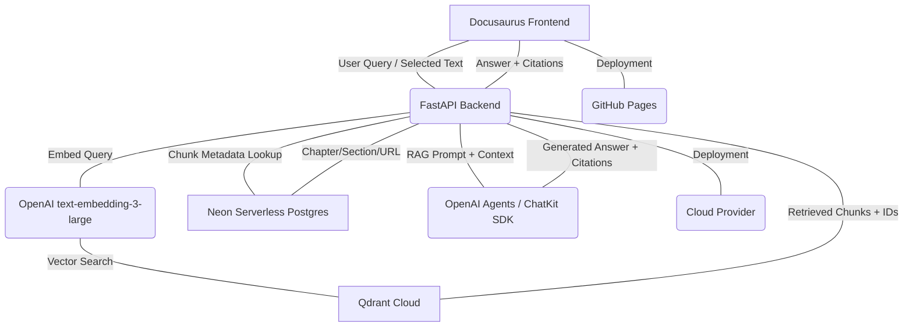

# Integrated RAG Chatbot Specification

## 1. System Overview

This specification details the design and implementation of an Integrated RAG (Retrieval-Augmented Generation) Chatbot embedded within a Docusaurus book website. The chatbot's primary function is to answer user questions exclusively from the book's content, preventing hallucinations, and providing cited sources. It supports two distinct modes: a global search across the entire book and a targeted search based on user-selected text. The solution leverages a modern, cloud-native tech stack for scalability and efficiency.

## 2. Architecture Diagram Description

The system architecture comprises a Docusaurus frontend, a FastAPI backend, Qdrant Cloud for vector storage, Neon Serverless Postgres for relational metadata, and OpenAI services for embeddings and LLM interactions.



**Description of Components:**

*   **Docusaurus Frontend (A)**: The user interface where the book content is displayed and the chatbot is embedded. It sends user queries (global or selected text) to the FastAPI backend. Deployed on GitHub Pages.
*   **FastAPI Backend (B)**: The core application logic. It receives queries from the frontend, orchestrates calls to embedding models, vector database, relational database, and the LLM. It processes retrieved information, constructs RAG prompts, and formats the final response with citations. Deployed to a cloud provider.
*   **OpenAI text-embedding-3-large (C)**: Used to convert text (user queries, book content chunks) into dense vector representations suitable for similarity search.
*   **Qdrant Cloud (D)**: A cloud-hosted vector database responsible for storing vectorized book content chunks. It performs efficient similarity searches to retrieve relevant text segments.
*   **Neon Serverless Postgres (E)**: A serverless relational database used to store metadata associated with each text chunk, including `chapter`, `section`, and `URL`, linked via `document_id` and `chunk_id`.
*   **OpenAI Agents / ChatKit SDK (F)**: The LLM interface that receives the RAG-prepared prompt (user query + retrieved context) and generates an answer. It is configured to prevent hallucinations and extract citation information.
*   **GitHub Pages (G)**: Hosts the static Docusaurus frontend.
*   **Cloud Provider (H)**: Hosts the FastAPI backend (e.g., Google Cloud Run, AWS Lambda, Azure Container Apps).

## 3. Data Ingestion Pipeline

A dedicated script or process will be developed to ingest Markdown files from the Docusaurus book into Qdrant and Neon Postgres.

1.  **Source**: All `.md` and `.mdx` files within the Docusaurus `docs/` directory.
2.  **File Parsing**:
    *   Read each `.md`/`.mdx` file.
    *   Extract content, identify chapters, sections, and their respective headings.
    *   Parse Docusaurus-specific front matter (e.g., `title`, `sidebar_label`).
    *   Derive the `URL` for each document based on Docusaurus routing.
3.  **Chunking Strategy**:
    *   Each document will be split into smaller, semantically meaningful text chunks.
    *   Prioritize splitting by Markdown headings (H1, H2, H3, etc.) to maintain contextual integrity.
    *   If a section is too large, further split into fixed-size (e.g., 500-1000 tokens) overlapping chunks (e.g., 10% overlap).
    *   Maintain `chapter` and `section` metadata for each chunk.
4.  **Embedding**:
    *   Each text chunk will be sent to OpenAI's `text-embedding-3-large` model to generate its vector representation.
5.  **Vector Storage (Qdrant)**:
    *   Each generated vector will be stored in Qdrant along with a payload containing essential metadata.
6.  **Metadata Storage (Neon Postgres)**:
    *   Document-level and chunk-level metadata will be stored in Neon Postgres. This includes:
        *   `document_id`: Unique ID for each Markdown file.
        *   `chunk_id`: Unique ID for each chunk within a document.
        *   `chapter`: The main chapter title.
        *   `section`: The specific heading/subsection the chunk belongs to.
        *   `url`: The relative URL of the Docusaurus page.
        *   `start_line`, `end_line`: Line numbers of the chunk within the original file (for precise citation).
        *   `qdrant_point_id`: Link to the corresponding point in Qdrant.

## 4. Vector Schema (Qdrant)

**Collection Name**: `docusaurus_book_rag`

**Vector Dimensions**: 3072 (for `text-embedding-3-large`)

**Payload Structure (per point)**:

```json
{
  "text_chunk": "string",         // The actual text content of the chunk
  "document_id": "string",        // UUID or hash of the original Markdown file
  "chunk_id": "string",           // UUID or hash of the specific chunk
  "chapter": "string",            // Title of the main chapter
  "section": "string",            // Heading/subsection title where the chunk originates
  "url": "string",                // Relative URL to the Docusaurus page
  "start_line": "integer",        // Starting line number in the original file
  "end_line": "integer"           // Ending line number in the original file
}
```

## 5. Database Schema (Neon Serverless Postgres)

**Database**: `rag_metadata_db`

**Table: `documents`**

| Column Name      | Data Type | Constraints          | Description                                |
| :--------------- | :-------- | :------------------- | :----------------------------------------- |
| `document_id`    | TEXT      | PRIMARY KEY          | Unique identifier for each Markdown file   |
| `title`          | TEXT      | NOT NULL             | Main title of the Docusaurus page/chapter  |
| `url`            | TEXT      | NOT NULL             | Relative URL to the Docusaurus page        |
| `last_indexed_at`| TIMESTAMP | NOT NULL             | Timestamp of the last successful indexing  |

**Table: `document_chunks`**

| Column Name       | Data Type | Constraints                      | Description                                   |
| :---------------- | :-------- | :------------------------------- | :-------------------------------------------- |
| `chunk_id`        | TEXT      | PRIMARY KEY                      | Unique identifier for each text chunk         |
| `document_id`     | TEXT      | NOT NULL, FOREIGN KEY (documents)| Foreign key linking to the `documents` table  |
| `chapter`         | TEXT      | NOT NULL                         | Chapter title derived from document structure |
| `section`         | TEXT      |                                  | Heading/subsection title of the chunk         |
| `start_line`      | INTEGER   | NOT NULL                         | Starting line number in the original file     |
| `end_line`        | INTEGER   | NOT NULL                         | Ending line number in the original file       |
| `qdrant_point_id` | TEXT      | UNIQUE, NOT NULL                 | ID of the corresponding point in Qdrant       |

## 6. API Endpoints

**Base URL**: `/api/v1`

### `POST /chat`

**Description**: Main chatbot endpoint for processing user queries in either global book search mode or selected-text-only RAG mode.

**Request Body**: `application/json`

```json
{
  "query": "string",             // User's question or prompt (required)
  "mode": "string",              // "global_book" or "selected_text" (required)
  "selected_text": "string",     // Required if mode is "selected_text", otherwise optional
  "context": "string"            // Optional: additional context for the LLM
}
```

**Request Example**:

```json
// Global book search
{
  "query": "What is ROS 2 navigation?",
  "mode": "global_book"
}

// Selected text search
{
  "query": "What does this section explain?",
  "mode": "selected_text",
  "selected_text": "ROS 2 navigation stack allows robots to navigate autonomously in complex environments..."
}
```

**Response Body**: `application/json`

```json
{
  "answer": "string",            // The chatbot's generated response
  "mode_used": "string",         // "global_book" or "selected_text"
  "citations": [                 // List of cited sources
    {
      "chapter": "string",       // Chapter title
      "section": "string",       // Heading/subsection title
      "url": "string"            // Relative URL to the source page
    }
  ],
  "error": "string"              // Optional: error message if an issue occurred
}
```

**Response Example**:

```json
{
  "answer": "ROS 2 navigation provides a framework for autonomous robot movement, including path planning and obstacle avoidance. (Source: ROS 2 Fundamentals, Navigation Stack)",
  "mode_used": "global_book",
  "citations": [
    {
      "chapter": "ROS 2 Fundamentals",
      "section": "Navigation Stack Overview",
      "url": "/docs/ros2-fundamentals/navigation-stack"
    }
  ],
  "error": null
}
```

## 7. Prompt Templates

The FastAPI backend will construct RAG prompts for the OpenAI LLM based on the query mode and retrieved context.

### System Prompt (Common for both modes)

```
You are an expert technical assistant specializing in the "Embodied AI: The Future of Robotics" book.
Your task is to answer user questions truthfully and concisely, strictly based ONLY on the provided context.
If the answer cannot be found in the provided context, state "I cannot answer this question based on the provided information." Do NOT make up information.
For every part of your answer that is derived from the context, you MUST cite the source.
Citations should be in the format: "(Source: [Chapter Title], [Section Heading])".
If multiple chunks from the same section are used, cite the section once.

Example: "The Robot Operating System 2 (ROS 2) is a set of software libraries and tools that help you build robot applications. (Source: ROS 2 Fundamentals, Introduction to ROS 2)"

---
Provided context:
```

### User Prompt (Global Book Search)

```
{system_prompt_content}

---
Context from the book:
{retrieved_chunks_concatenated}

---
User query: {user_query}
```

### User Prompt (Selected Text Only Search)

```
{system_prompt_content}

---
User-selected text to analyze:
{user_selected_text}

---
Context from the book relevant to the selected text:
{retrieved_chunks_concatenated}

---
User query: {user_query}
```

## 8. Security Considerations

1.  **API Keys**: All sensitive credentials (OpenAI API Key, Qdrant API Key, Neon Postgres Connection String) must be stored as environment variables and NEVER hardcoded.
2.  **Input Validation**: Strict validation of all incoming API requests to prevent injection attacks and ensure data integrity.
3.  **CORS**: Implement appropriate CORS policies on the FastAPI backend to allow requests only from the Docusaurus frontend's domain(s).
4.  **Least Privilege**: The backend service will operate with the minimum necessary permissions to interact with Qdrant, Neon, and OpenAI.
5.  **Rate Limiting**: Implement basic rate limiting on the `/chat` endpoint to prevent abuse and protect backend resources. (See Future Extensions for advanced handling)
6.  **Data Privacy**: Ensure that no personally identifiable information (PII) from users is logged or stored, unless explicitly required and consented.

## 9. Error Handling

The FastAPI backend will provide robust error handling for various scenarios:

*   **HTTP 400 Bad Request**: Invalid input format or missing required parameters in the request body.
*   **HTTP 404 Not Found**: If a requested resource (e.g., a specific document, if applicable) is not found.
*   **HTTP 500 Internal Server Error**:
    *   Failure to connect to Qdrant or Neon Postgres.
    *   Errors during embedding generation (OpenAI API issues).
    *   Errors during LLM inference (OpenAI API issues, prompt engineering failures).
    *   No relevant context found (if strict context retrieval is enabled and yields nothing).
*   **Custom Error Responses**: Standardized JSON error objects including a clear `message` and an optional `code` for programmatic handling.

## 10. Acceptance Criteria

### Functional Requirements

*   **FR1: Indexing Markdown Files**:
    *   **Given** a Docusaurus book with `.md` and `.mdx` files in the `docs/` directory,
    *   **When** the ingestion pipeline is executed,
    *   **Then** all files are parsed, chunked, embedded, and stored in Qdrant and Neon Postgres.
    *   **And** `document_id`, `chunk_id`, `chapter`, `section`, `url`, `start_line`, `end_line`, and `qdrant_point_id` are correctly stored in Neon.
    *   **And** corresponding vectors and payloads (including `text_chunk`, `document_id`, `chunk_id`, `chapter`, `section`, `url`, `start_line`, `end_line`) are stored in Qdrant.
*   **FR2: `/chat` API Endpoint**:
    *   **Given** the FastAPI backend is running,
    *   **When** a `POST` request is sent to `/api/v1/chat` with valid `query` and `mode`,
    *   **Then** the API responds with a JSON object containing `answer`, `mode_used`, and `citations`.
*   **FR3: Global Book RAG Search**:
    *   **Given** the chatbot is in `global_book` mode,
    *   **When** a user asks a question whose answer is present in the book content,
    *   **Then** the chatbot returns a correct answer derived solely from the book.
    *   **And** the answer includes correct citations (chapter, section, URL) to the source.
    *   **When** a user asks a question whose answer is NOT present in the book content,
    *   **Then** the chatbot responds with "I cannot answer this question based on the provided information."
    *   **And** no citations are provided.
*   **FR4: Selected-Text-Only RAG Search**:
    *   **Given** the chatbot is in `selected_text` mode with a `selected_text` payload,
    *   **When** a user asks a question relevant to the `selected_text` (and supported by nearby context),
    *   **Then** the chatbot returns a correct answer derived solely from the `selected_text` and its immediate context.
    *   **And** the answer includes correct citations (chapter, section, URL).
    *   **When** a user asks a question not directly related to the `selected_text` (even if in book),
    *   **Then** the chatbot responds with "I cannot answer this question based on the provided information."
    *   **And** no citations are provided.
*   **FR5: Hallucination Prevention**:
    *   **Given** a query where the answer is ambiguous or outside the provided context,
    *   **When** the chatbot generates a response,
    *   **Then** the response must explicitly state inability to answer or provide an answer strictly within context, avoiding fabricated information.
*   **FR6: Environment Variable Security**:
    *   **Given** API keys and connection strings,
    *   **When** the backend is deployed,
    *   **Then** all sensitive data is loaded from environment variables and not hardcoded in the codebase.
    *   **And** attempts to run without required environment variables result in clear configuration errors.

### Performance & Reliability (Non-Functional)

*   **P1: Latency**: Global search queries should respond within 5 seconds (p95).
*   **P2: Scalability**: The FastAPI backend should be able to handle at least 50 concurrent requests without significant degradation in latency.
*   **P3: Availability**: Backend services should aim for 99.9% uptime.
*   **P4: Data Freshness**: Ingestion pipeline should support incremental updates and be able to re-index the entire book within 4 hours.

## 11. Future Extensions

1.  **Frontend Integration**: Develop a React component for the Docusaurus site to seamlessly integrate the chatbot UI.
2.  **Advanced Chunking**: Implement more sophisticated chunking strategies (e.g., recursive text splitter, sentence transformers for semantic chunking).
3.  **Real-time Indexing**: Webhook-based indexing triggered by changes in GitHub repository to keep content always up-to-date.
4.  **User Feedback**: Implement a mechanism for users to provide feedback on chatbot answers (e.g., thumbs up/down, report inaccuracy).
5.  **Analytics & Monitoring**: Integrate with observability tools (e.g., Prometheus, Grafana, ELK stack) for usage analytics, error tracking, and performance monitoring.
6.  **Multi-Language Support**: Extend to handle books in multiple languages and provide multilingual RAG.
7.  **Conversational Memory**: Implement short-term or long-term memory for multi-turn conversations.
8.  **Fine-tuning LLM**: Potentially fine-tune a smaller LLM on book content for improved domain-specific answers and reduced latency/cost.
9.  **Deployment Automation**: Automate backend deployment using CI/CD pipelines (e.g., GitHub Actions, GitLab CI).
10. **Pre-computation of Answer Spans**: Explore techniques to pre-compute precise answer spans within retrieved chunks to directly highlight relevant text in the frontend.
